# IKB42603 - Lab 6: Object Storage Security & the Data Security Lifecycle

| Item | Details |
| --- | --- |
| Course | IKB42603 - Cloud Computing Security Essentials |
| Lab | Lab 6 - Object Storage Security & the Data Security Lifecycle (Weeks 11-12) |
| Student name | Muhammad Adli Firdaus |
| Student ID | 52215225178 |
| Operating System | Kali Linux (VMware Workstation) |
| Environment | LocalStack Pro (`localstack/localstack-pro:latest`), `ENFORCE_IAM=1` |
| Bucket used | `miit-patient-records` |

> **Note on redaction:** As a matter of standard practice, all identifying numbers in this report — AWS account ID, KMS key ID, the bucket's random suffix, and S3 object version IDs — have been redacted before publication, even though the account and key values in this LocalStack lab are local dummy identities rather than real AWS credentials. Corresponding regions in the evidence screenshots are blacked out for the same reason.

## Objective

This lab covers object storage security and the data security lifecycle, split into two sessions:

- **Session A** is about who can reach the data: provisioning object storage, classifying data, reproducing and remediating a public-bucket breach, and resolving identity vs resource policy conflicts.
- **Session B** is about what state the data is in: default encryption at rest, delegated access via presigned URLs, versioning and data remanence, and lifecycle/cryptographic erasure.

By the end of this lab, the following outcomes are demonstrated:
1. Object storage provisioned and data classified by sensitivity.
2. The archetypal public-bucket breach reproduced and remediated with Block Public Access and least privilege.
3. Identity-based vs resource-based policy conflict resolution.
4. Default encryption at rest (SSE-KMS) enforced without uploader action.
5. A presigned URL issued and its risks assessed.
6. Versioning, delete markers, object-level data remanence, and provable deletion via cryptographic erasure.

## Environment Setup

A LocalStack Pro container was started. The first attempt failed because the `LOCALSTACK_AUTH_TOKEN` environment variable was empty in the shell, so the container exited with a license activation error.

```bash
docker run -d --name localstack -p 4566:4566 \
  -e LOCALSTACK_AUTH_TOKEN=$LOCALSTACK_AUTH_TOKEN \
  -e ENFORCE_IAM=1 \
  localstack/localstack-pro:latest
```

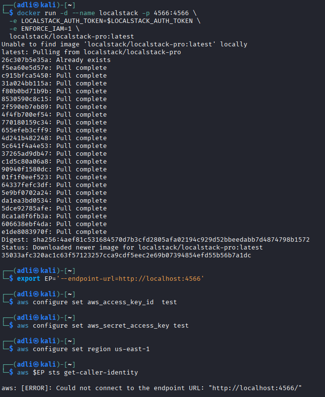

```bash
docker ps -a
docker logs localstack
```

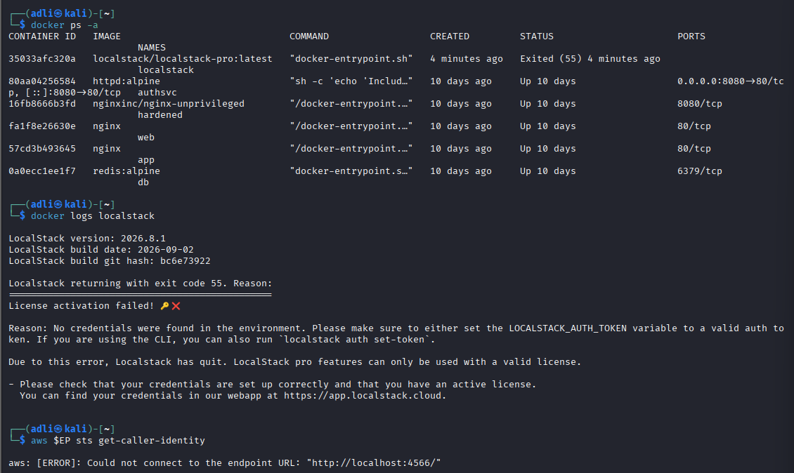

The container was restarted with the same (empty) variable to confirm the diagnosis before fixing it:

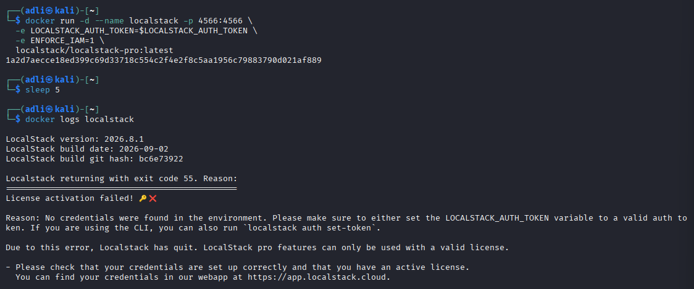

The auth token was exported into the shell, the old container removed, and a fresh container started:

```bash
export LOCALSTACK_AUTH_TOKEN='ls-********************************'
docker rm -f localstack
docker run -d --name localstack -p 4566:4566 \
  -e LOCALSTACK_AUTH_TOKEN=$LOCALSTACK_AUTH_TOKEN \
  -e ENFORCE_IAM=1 \
  localstack/localstack-pro:latest
sleep 5
docker logs localstack
```

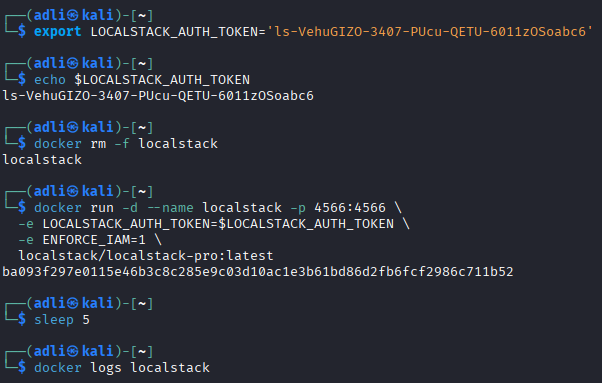

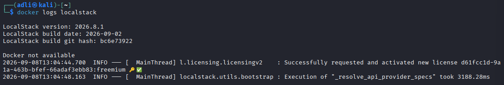

```bash
export EP='--endpoint-url=http://localhost:4566'
aws configure set aws_access_key_id  test
aws configure set aws_secret_access_key test
aws configure set region us-east-1

aws $EP sts get-caller-identity
```

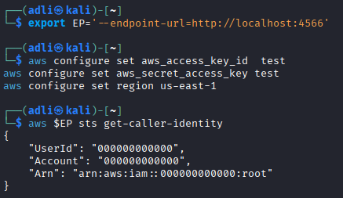

**Result:** LocalStack Pro running with `ENFORCE_IAM=1`, CLI pointed at it, dummy identity confirmed under account `████████████`.

## Session A (Week 11) - Object Storage & the Exposure Problem

### Task 1 - Classify the Data Before You Store It

```bash
export BUCKET=miit-patient-records-$RANDOM
echo $BUCKET
aws $EP s3api create-bucket --bucket $BUCKET
```

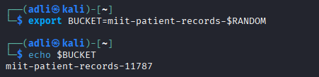

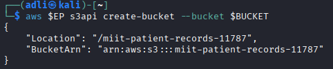

```bash
echo 'Ward visiting hours 10am-8pm'                 > public-notice.txt
echo 'Staff duty schedule, week 12'                 > internal-roster.txt
echo 'Patient: Ahmad bin Ali, Diagnosis: confidential' > confidential-record.txt
```

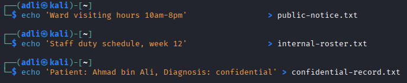

```bash
aws $EP s3api put-object --bucket $BUCKET --key public/notice.txt \
  --body public-notice.txt       --tagging 'classification=public'
aws $EP s3api put-object --bucket $BUCKET --key internal/roster.txt \
  --body internal-roster.txt     --tagging 'classification=internal'
aws $EP s3api put-object --bucket $BUCKET --key confidential/record.txt \
  --body confidential-record.txt --tagging 'classification=confidential'
```

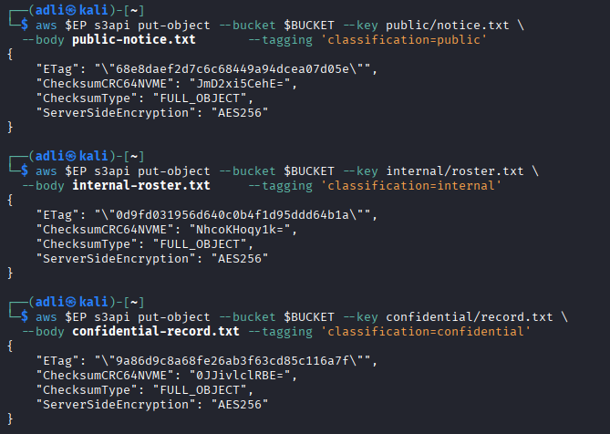

```bash
aws $EP s3api list-objects-v2 --bucket $BUCKET \
  --query 'Contents[].[Key,Size]' --output table
aws $EP s3api get-object-tagging --bucket $BUCKET --key confidential/record.txt
```

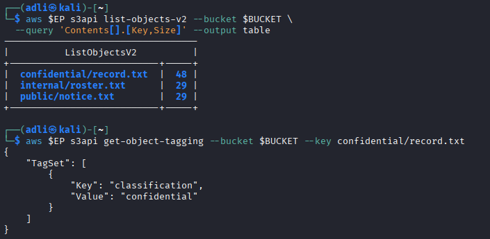

**Data Classification Table**

| Classification | Who may read it | Impact if leaked | Control implemented |
| --- | --- | --- | --- |
| public | Anyone (general public) | Negligible - information is already intended for public disclosure | No access restriction required |
| internal | Authenticated staff / internal account holders only | Moderate - exposes internal operational information (duty schedules) that aids reconnaissance of the organisation | Least-privilege bucket policy scoped to the `internal/*` prefix, account principal only |
| confidential | Authorised care staff / data owner only | Severe - direct disclosure of patient health data; breach of PDPA/medical confidentiality obligations, reputational and legal harm | Block Public Access + least-privilege policy + default SSE-KMS encryption + versioning and lifecycle controls |

**Result:** Three objects uploaded (`public/notice.txt`, `internal/roster.txt`, `confidential/record.txt`), each correctly tagged by classification. Note the key names use a flat namespace - `confidential/` is not a folder, it is part of the key string, which is why a careless prefix (or `*`) in a policy can expose everything at once.

### Task 2 - Reproduce the Archetypal Breach

```bash
cat > public-policy.json <<JSON
{
  "Version": "2012-10-17",
  "Statement": [{
    "Sid": "PublicReadEverything",
    "Effect": "Allow",
    "Principal": "*",
    "Action": "s3:GetObject",
    "Resource": "arn:aws:s3:::$BUCKET/*"
  }]
}
JSON
```

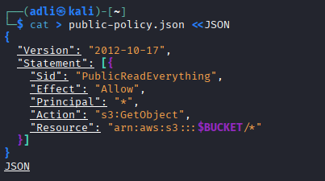

```bash
aws $EP s3api put-bucket-policy --bucket $BUCKET --policy file://public-policy.json
aws $EP s3api get-bucket-policy --bucket $BUCKET --query Policy --output text
```

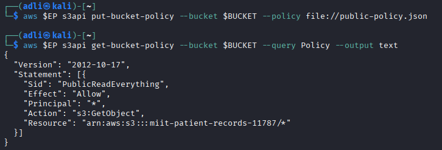

```bash
curl -s -o leaked.txt -w 'HTTP %{http_code}\n' \
  http://localhost:4566/$BUCKET/confidential/record.txt
cat leaked.txt
```

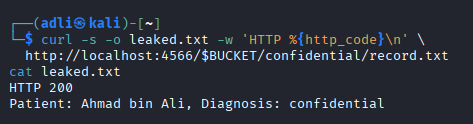

**Result:** `HTTP 200` and the confidential patient record (`Patient: Ahmad bin Ali, Diagnosis: confidential`) were retrieved with a plain, unauthenticated `curl` request. There was no exploit, malware, or vulnerability - only a policy statement containing `"Principal": "*"`.

### Task 3 - Remediate with Block Public Access

```bash
aws $EP s3api delete-bucket-policy --bucket $BUCKET
```

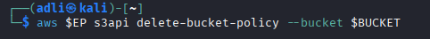

```bash
aws $EP s3api put-public-access-block --bucket $BUCKET \
  --public-access-block-configuration \
    BlockPublicAcls=true,IgnorePublicAcls=true,BlockPublicPolicy=true,RestrictPublicBuckets=true

aws $EP s3api get-public-access-block --bucket $BUCKET
```

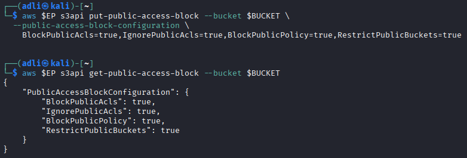

```bash
aws $EP s3api put-bucket-policy --bucket $BUCKET --policy file://public-policy.json
curl -s -o /dev/null -w 'anonymous read now: HTTP %{http_code}\n' \
  http://localhost:4566/$BUCKET/confidential/record.txt
```

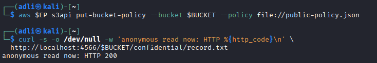

```bash
cat > least-privilege-policy.json <<JSON
{
  "Version": "2012-10-17",
  "Statement": [{
    "Sid": "AccountReadInternalOnly",
    "Effect": "Allow",
    "Principal": {"AWS": "arn:aws:iam::████████████:root"},
    "Action": "s3:GetObject",
    "Resource": "arn:aws:s3:::$BUCKET/internal/*"
  }]
}
JSON

aws $EP s3api put-bucket-policy --bucket $BUCKET --policy file://least-privilege-policy.json
aws $EP s3api get-bucket-policy --bucket $BUCKET --query Policy --output text
```

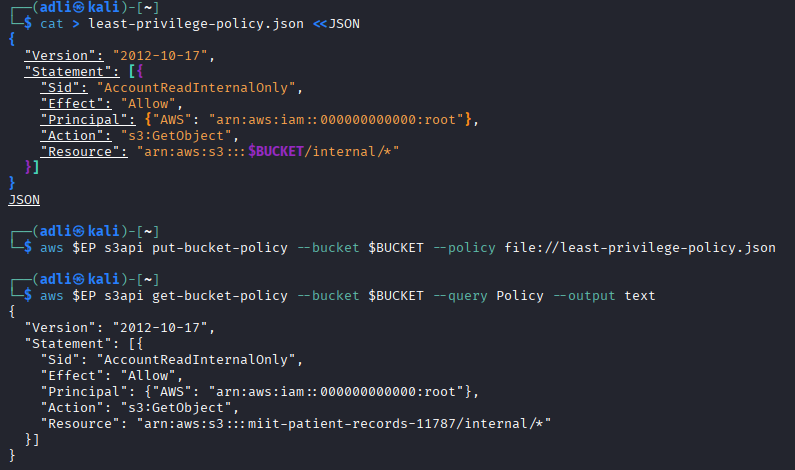

**Result / Verify or explain:** `get-public-access-block` correctly stored all four flags as `true`. However, the re-applied public policy was accepted (not rejected) and the anonymous read still returned `HTTP 200` - **this is a known LocalStack enforcement gap**: it stores the Block Public Access configuration faithfully but does not always enforce it. On real AWS, `BlockPublicPolicy: true` would have rejected the `put-bucket-policy` call outright at the API level. This matters because a preventative guardrail stops a dangerous configuration from ever being written, while a merely detective control only reports the problem after it already exists - which is far weaker protection for an organisation with many engineers who might otherwise re-introduce a public policy by mistake.

### Task 4 - Identity Policy vs Resource Policy

```bash
aws $EP iam create-user --user-name DataAnalyst

cat > analyst-iam.json <<'JSON'
{
  "Version": "2012-10-17",
  "Statement": [{
    "Effect": "Allow",
    "Action": ["s3:GetObject", "s3:ListBucket"],
    "Resource": "*"
  }]
}
JSON

aws $EP iam put-user-policy --user-name DataAnalyst \
  --policy-name S3ReadAll --policy-document file://analyst-iam.json

aws $EP iam create-access-key --user-name DataAnalyst \
  --query 'AccessKey.[AccessKeyId,SecretAccessKey]' --output text
```

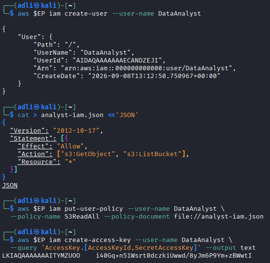

```bash
aws configure --profile analyst set aws_access_key_id     "$ANALYST_KEY_ID"
aws configure --profile analyst set aws_secret_access_key "$ANALYST_SECRET"
aws configure --profile analyst set region us-east-1
```

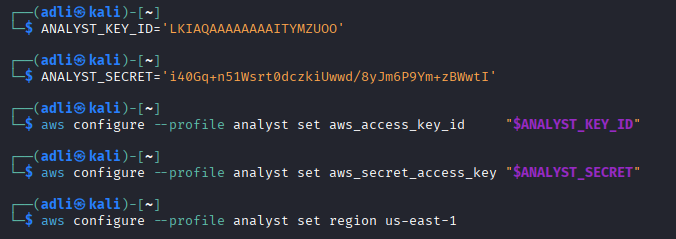

```bash
cat > deny-confidential.json <<JSON
{
  "Version": "2012-10-17",
  "Statement": [
    {
      "Sid": "AllowAnalystInternal",
      "Effect": "Allow",
      "Principal": {"AWS": "arn:aws:iam::████████████:user/DataAnalyst"},
      "Action": "s3:GetObject",
      "Resource": "arn:aws:s3:::$BUCKET/internal/*"
    },
    {
      "Sid": "DenyAnalystConfidential",
      "Effect": "Deny",
      "Principal": {"AWS": "arn:aws:iam::████████████:user/DataAnalyst"},
      "Action": "s3:*",
      "Resource": "arn:aws:s3:::$BUCKET/confidential/*"
    }
  ]
}
JSON

aws $EP s3api put-bucket-policy --bucket $BUCKET --policy file://deny-confidential.json

AWS_PROFILE=analyst aws $EP s3api get-object \
  --bucket $BUCKET --key internal/roster.txt analyst-internal.txt && echo "internal: ALLOWED"
```

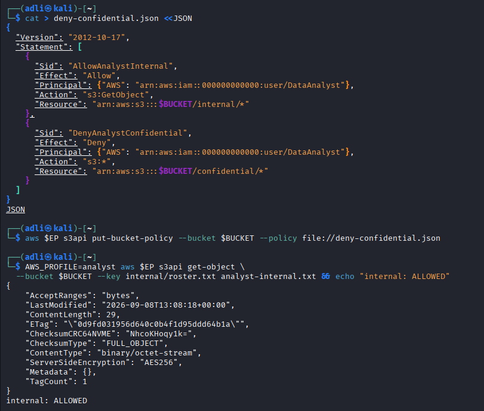

```bash
AWS_PROFILE=analyst aws $EP s3api get-object \
  --bucket $BUCKET --key confidential/record.txt analyst-conf.txt || echo "confidential: DENIED"
```

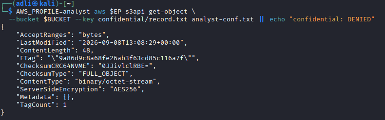

```bash
aws $EP s3api delete-bucket-policy --bucket $BUCKET
```

**Result table:**

| Request | Expected (real AWS) | Observed (LocalStack) |
| --- | --- | --- |
| `GetObject internal/roster.txt` | ALLOWED | **ALLOWED** - object retrieved successfully |
| `GetObject confidential/record.txt` | DENIED (explicit Deny wins) | **ALLOWED** - object retrieved successfully, no error |

**Written evaluation:** For `internal/roster.txt`, the IAM identity policy allows `GetObject` on `Resource: "*"` and no bucket-policy statement contradicts it, so the identity policy decides: **ALLOWED**. For `confidential/record.txt`, the IAM identity policy alone would allow the request, but the bucket policy's `DenyAnalystConfidential` statement explicitly denies `s3:*` on `confidential/*` for this exact principal. Per standard AWS evaluation order - default deny -> any explicit Deny -> any explicit Allow - **an explicit Deny always overrides an Allow**, regardless of whether it originates from the identity or the resource policy, so the correct outcome on real AWS is `AccessDenied`. LocalStack did not enforce this Deny in this run despite `ENFORCE_IAM=1`, which is a known IAM-enforcement limitation of the platform rather than a fault in the policy itself. The policy was removed before Session B since a `Deny` on `s3:*` risks locking out even the bucket owner.

## Session B (Week 12) - Protecting, Retaining and Retiring Data

### Task 5 - Default Encryption at Rest (SSE-KMS)

```bash
export KEY_ID=$(aws $EP kms create-key \
  --description 'IKB42603 Lab6 patient records bucket key' \
  --query 'KeyMetadata.KeyId' --output text)
echo $KEY_ID

cat > encryption.json <<JSON
{
  "Rules": [{
    "ApplyServerSideEncryptionByDefault": {
      "SSEAlgorithm": "aws:kms",
      "KMSMasterKeyID": "$KEY_ID"
    },
    "BucketKeyEnabled": true
  }]
}
JSON

aws $EP s3api put-bucket-encryption --bucket $BUCKET \
  --server-side-encryption-configuration file://encryption.json
aws $EP s3api get-bucket-encryption --bucket $BUCKET
```

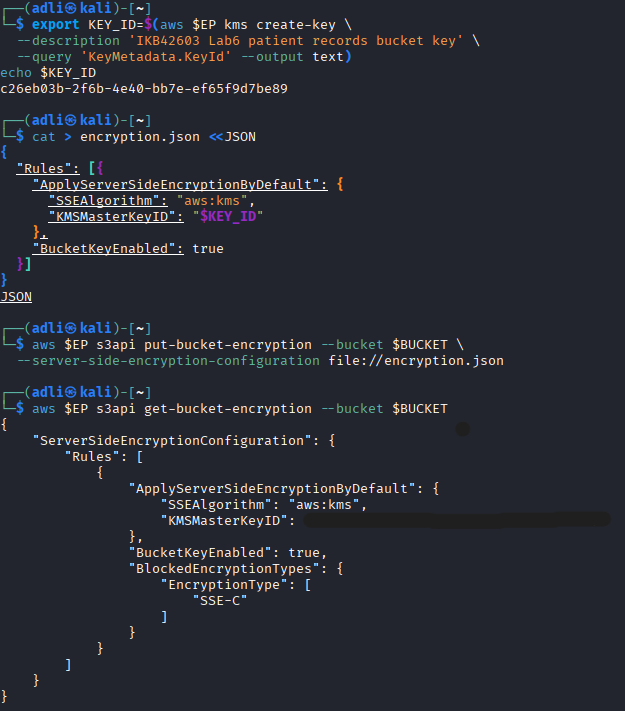

```bash
aws $EP s3api put-object --bucket $BUCKET \
  --key confidential/record-v2.txt --body confidential-record.txt

aws $EP s3api head-object --bucket $BUCKET --key confidential/record-v2.txt \
  --query '[ServerSideEncryption,SSEKMSKeyId,BucketKeyEnabled]' --output text
```

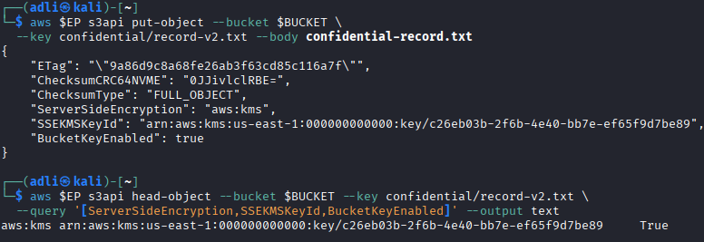

**Result:** `head-object` returned `ServerSideEncryption: aws:kms`, `SSEKMSKeyId: arn:aws:kms:us-east-1:████████████:key/████████-████-████-████-████████████`, `BucketKeyEnabled: True` - proof that the bucket-level default control encrypted the object automatically, with no encryption flags supplied at upload time.

### Task 6 - Delegated Access and the Condition-Key Trap

```bash
aws $EP s3 presign s3://$BUCKET/internal/roster.txt --expires-in 60
```

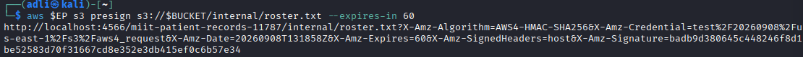

```bash
URL='PASTED_PRESIGNED_URL'
curl -s -w '  <-- HTTP %{http_code}\n' "$URL"

sleep 65
curl -s -o /dev/null -w 'after expiry: HTTP %{http_code}\n' "$URL"
```

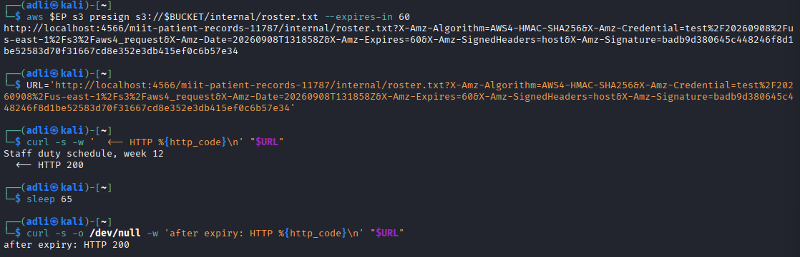

```bash
cat > secure-transport.json <<JSON
{
  "Version": "2012-10-17",
  "Statement": [{
    "Sid": "DenyUnencryptedTransport",
    "Effect": "Deny",
    "Principal": "*",
    "Action": "s3:*",
    "Resource": ["arn:aws:s3:::$BUCKET", "arn:aws:s3:::$BUCKET/*"],
    "Condition": {"Bool": {"aws:SecureTransport": "false"}}
  }]
}
JSON

aws $EP s3api put-bucket-policy --bucket $BUCKET --policy file://secure-transport.json
aws $EP s3api list-objects-v2 --bucket $BUCKET
```

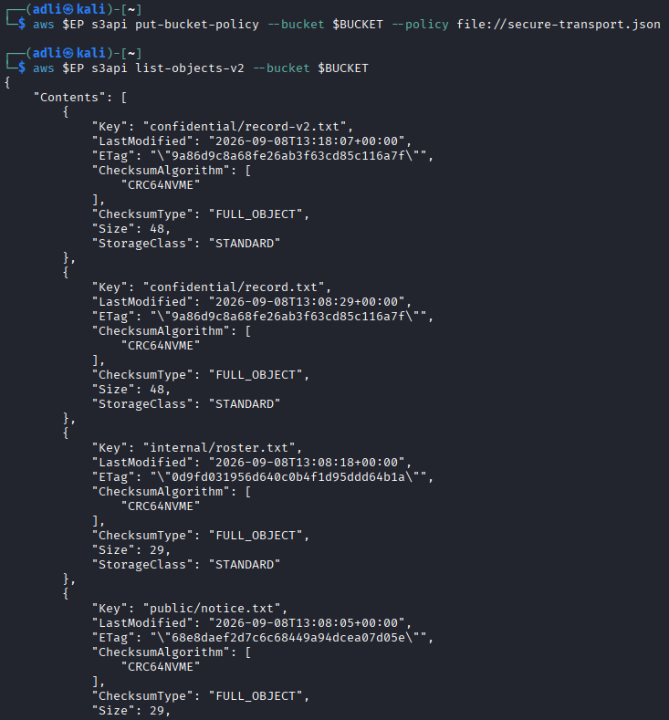

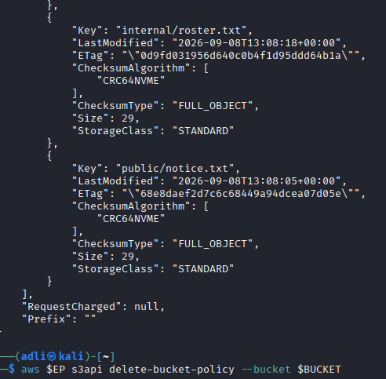

```bash
aws $EP s3api delete-bucket-policy --bucket $BUCKET
```

**Result / Verify or explain:** The presigned URL still returned `HTTP 200` after its 60-second expiry had passed - LocalStack does not always enforce presigned URL expiry server-side. On real AWS, the request is rejected once the current time exceeds the `X-Amz-Date` + `X-Amz-Expires` window, because `X-Amz-Signature` cryptographically binds the URL to that window; anyone holding a valid presigned URL before it lapses is fully authorised for that single action on that single object, which is exactly why presigned URLs must be shared cautiously and with the shortest practical expiry.

The `aws:SecureTransport` Deny policy should have blocked every request (including the owner's own `list-objects-v2`), since the LocalStack endpoint is plain `http://` and the condition matches `aws:SecureTransport = false`. Instead, `list-objects-v2` still succeeded - another LocalStack condition-key enforcement gap. The underlying lesson still holds: **a condition key must always be evaluated against the environment it will actually run in, not the environment it was written for.** A policy tested against an HTTP development endpoint like LocalStack behaves differently once deployed against HTTPS production AWS, where the same condition would only catch genuinely insecure callers instead of matching everyone.

### Task 7 - Versioning, Delete Markers & Data Remanence

```bash
aws $EP s3api put-bucket-versioning --bucket $BUCKET \
  --versioning-configuration Status=Enabled
aws $EP s3api get-bucket-versioning --bucket $BUCKET

echo 'Patient: Ahmad bin Ali, Diagnosis: hypertension' > rec-v2.txt
echo 'Patient: [REDACTED], Diagnosis: [REDACTED]'      > rec-v3.txt
```

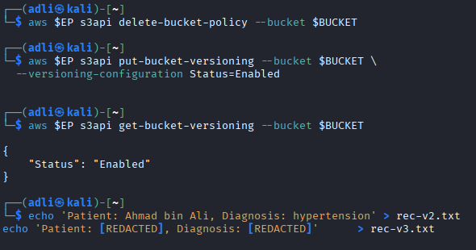

```bash
aws $EP s3api put-object --bucket $BUCKET --key confidential/record.txt \
  --body rec-v2.txt --query VersionId --output text
aws $EP s3api put-object --bucket $BUCKET --key confidential/record.txt \
  --body rec-v3.txt --query VersionId --output text
```

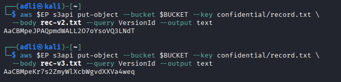

```bash
aws $EP s3api list-object-versions --bucket $BUCKET \
  --prefix confidential/record.txt \
  --query 'Versions[].[VersionId,IsLatest,Size]' --output table

aws $EP s3api delete-object --bucket $BUCKET --key confidential/record.txt
```

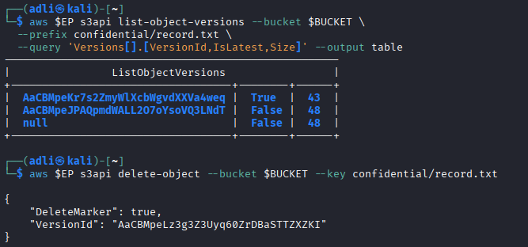

```bash
aws $EP s3api list-object-versions --bucket $BUCKET \
  --prefix confidential/record.txt \
  --query 'DeleteMarkers[].[VersionId,IsLatest]' --output table
```

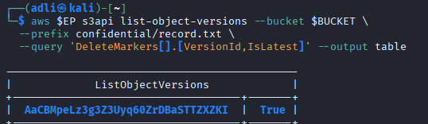

```bash
aws $EP s3api get-object --bucket $BUCKET --key confidential/record.txt gone.txt
```

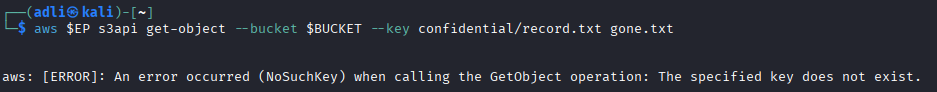

```bash
aws $EP s3api get-object --bucket $BUCKET --key confidential/record.txt \
  --version-id null recovered.txt
```

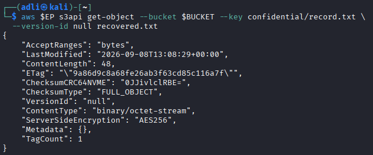

```bash
cat recovered.txt
```

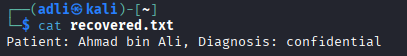

**Result:** Version history captured -

| Version ID | Is Latest | Size |
| --- | --- | --- |
| `████████████████████████████████` (v3, redacted) | True (before delete) | 43 |
| `████████████████████████████████` (v2, corrected) | False | 48 |
| `null` (v1, original) | False | 48 |

After `delete-object`, a delete marker (`████████████████████████████████`) became the current version. To an ordinary caller the object is gone (`NoSuchKey`), but requesting `--version-id null` explicitly recovered the original, unredacted record: `Patient: Ahmad bin Ali, Diagnosis: confidential`. This is **object-level data remanence** - the redacted (v3) content, the corrected (v2) content, and critically the original unredacted diagnosis all remained fully recoverable underneath the delete marker. "We deleted the record" is not proof of erasure.

### Task 8 - Lifecycle, Retention & Cryptographic Erasure

```bash
cat > lifecycle.json <<'JSON'
{
  "Rules": [
    {
      "ID": "RetireConfidentialRecords",
      "Filter": {"Prefix": "confidential/"},
      "Status": "Enabled",
      "NoncurrentVersionExpiration": {"NoncurrentDays": 30}
    },
    {
      "ID": "AbortIncompleteUploads",
      "Filter": {"Prefix": ""},
      "Status": "Enabled",
      "AbortIncompleteMultipartUpload": {"DaysAfterInitiation": 7}
    }
  ]
}
JSON
```

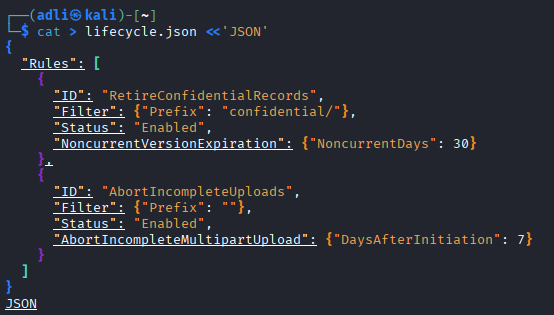

```bash
aws $EP s3api put-bucket-lifecycle-configuration --bucket $BUCKET \
  --lifecycle-configuration file://lifecycle.json
```

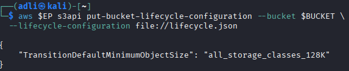

```bash
aws $EP s3api get-bucket-lifecycle-configuration --bucket $BUCKET \
  --query 'Rules[].[ID,Status]' --output table
```

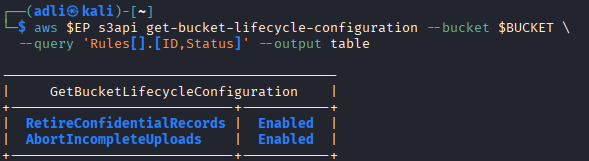

```bash
aws $EP kms describe-key --key-id $KEY_ID \
  --query 'KeyMetadata.[KeyState,Enabled]' --output text
```

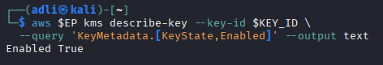

```bash
aws $EP kms disable-key --key-id $KEY_ID
aws $EP kms schedule-key-deletion --key-id $KEY_ID --pending-window-in-days 7
aws $EP kms describe-key --key-id $KEY_ID \
  --query 'KeyMetadata.[KeyState,DeletionDate]' --output text

aws $EP s3api get-object --bucket $BUCKET \
  --key confidential/record-v2.txt after-erasure.txt
```

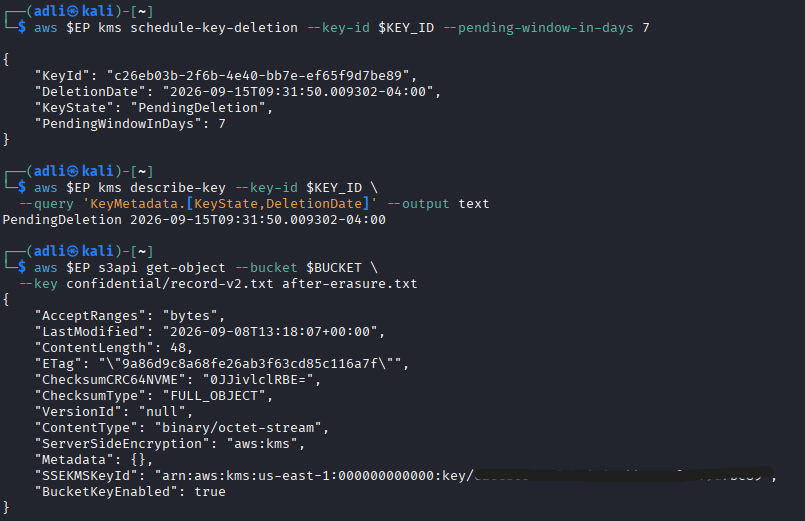

**Result / Verify or explain:** The KMS key moved to `PendingDeletion` with a deletion date 7 days out, as expected. However, reading `confidential/record-v2.txt` (encrypted under this now-disabled key) still succeeded and returned plaintext - LocalStack does not always re-check KMS key state on every S3 read. On real AWS, any further `Decrypt`/`GenerateDataKey` call against a disabled or deleted key is rejected, making the ciphertext permanently unrecoverable. The principle was demonstrated conceptually in Lab 3's KMS `encrypt` -> `disable-key` -> `decrypt` sequence, which does fail as expected. **Cryptographic erasure gives an auditor a stronger assurance than overwriting data**, because the organisation does not control the physical storage media underlying a cloud provider's disks - destroying the single key that wraps every copy, version, and backup of the data renders all of it simultaneously unrecoverable, regardless of how many copies exist or where they are physically stored.

## Verification

```bash
echo "=== IKB42603 Lab 6 verification: $BUCKET ==="
aws $EP s3api get-public-access-block --bucket $BUCKET \
  --query 'PublicAccessBlockConfiguration' --output text
aws $EP s3api get-bucket-versioning --bucket $BUCKET --output text
aws $EP s3api get-bucket-encryption --bucket $BUCKET \
  --query 'ServerSideEncryptionConfiguration.Rules[0].ApplyServerSideEncryptionByDefault.[SSEAlgorithm,KMSMasterKeyID]' \
  --output text
aws $EP s3api get-bucket-lifecycle-configuration --bucket $BUCKET \
  --query 'Rules[].[ID,Status]' --output text
aws $EP kms describe-key --key-id $KEY_ID --query 'KeyMetadata.KeyState' --output text
```

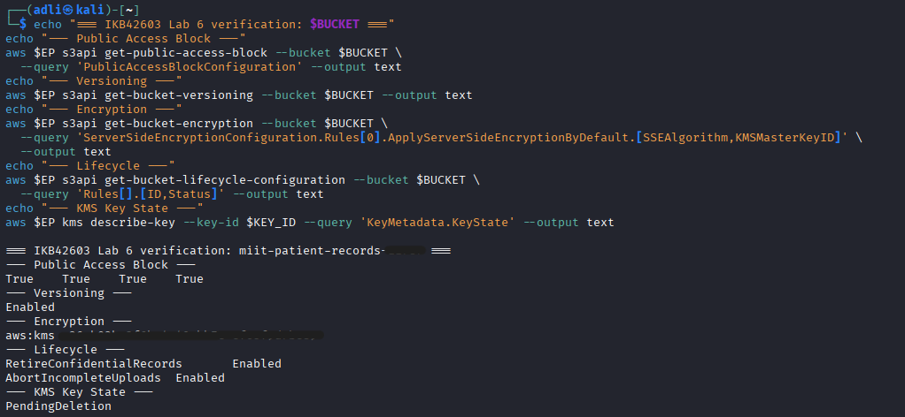

**Result:**

```
=== IKB42603 Lab 6 verification: miit-patient-records-█████ ===
Public Access Block  -- True True True True
Versioning            -- Enabled
Encryption             -- aws:kms  ████████-████-████-████-████████████
Lifecycle               -- RetireConfidentialRecords: Enabled | AbortIncompleteUploads: Enabled
KMS Key State           -- PendingDeletion
```

This confirms the bucket's final security posture: public access blocked, versioning enabled, default encryption enforced with a customer-managed key, a retention/lifecycle policy in force, and the encryption key itself in its final, provable-erasure state.

## Short-Answer Questions

**Q1. Which single element of the Task 2 policy caused the exposure, and why is `Principal: "*"` more dangerous on a bucket policy than an over-broad IAM policy attached to one user?**

The single element responsible was `"Principal": "*"` combined with `"Effect": "Allow"` - it grants the permitted action to any requester, authenticated or not, as proven by the anonymous `curl` request in Task 2 succeeding with no AWS credentials at all. This is more dangerous on a bucket (resource) policy than an over-broad IAM policy on one user because a resource policy with `Principal: "*"` bypasses the identity layer entirely - an attacker needs nothing more than the object's URL. An over-broad IAM policy on a single user is still bounded: an attacker would first need to compromise that specific user's credentials. A public bucket policy has no such boundary; the blast radius is the entire internet.

**Q2. Explain the difference between an identity-based policy and a resource-based policy. In Task 4, which one decided each of the analyst's two requests?**

An identity-based policy is attached to an IAM principal (user, group, or role) and defines what that principal may do. A resource-based policy is attached directly to a resource (here, the S3 bucket) and defines who may act on that specific resource, regardless of the caller's own identity policy. Both are evaluated together for every request. In Task 4, the analyst's identity policy (an Allow on `Resource: "*"`) governed the `internal/roster.txt` request, since no bucket-policy statement contradicted it. For `confidential/record.txt`, the bucket (resource) policy's explicit Deny statement is what should have decided the outcome on real AWS - an explicit Deny in either policy type always overrides an Allow from the other, though LocalStack did not enforce this in the observed run.

**Q3. Block Public Access is described as a guardrail rather than a control. What is the difference, and why does the distinction matter for an organisation with many engineers?**

A control is typically a specific, situational configuration (e.g. a correctly scoped bucket policy) that must be deliberately authored and correctly maintained by whoever manages that resource. A guardrail is a standing, account- or bucket-wide restriction that actively prevents an entire class of misconfiguration from being applied at all, regardless of what any individual policy says. This distinction matters for an organisation with many engineers because a guardrail removes reliance on every engineer, at every point, writing a correct policy - it fails safe even when a well-meaning colleague makes a mistake, whereas a control only protects if it was configured correctly in the first place and stays that way.

**Q4. Your bucket has default SSE-KMS encryption. Does that protect the confidential record from the analyst in Task 4? Explain precisely what server-side encryption does and does not defend against.**

No. Server-side encryption at rest protects data against unauthorised access to the underlying physical storage - for example, a stolen disk, a cloud-provider-side storage breach, or improperly discarded media. It does not defend against a caller who is authenticated and permitted (or believed to be permitted) to make a normal API call: S3 transparently decrypts the object for any request that passes IAM and bucket-policy evaluation. The analyst's credentials were valid and the call was properly authenticated, so SSE-KMS was irrelevant to that access path - only the bucket policy's Deny statement, not encryption, was the intended defence against this scenario.

**Q5. A patient invokes their right to erasure. Using your Task 7 evidence, explain why `delete-object` alone is not compliant, and describe two mechanisms that would make the deletion provable.**

Task 7 showed that `delete-object` on a versioned bucket does not remove data - it writes a delete marker over the current version while every prior version, including the original, unredacted diagnosis, remains fully retrievable by version ID. This does not satisfy an erasure obligation under a privacy regime such as PDPA or GDPR, since the personal data still physically exists and remains retrievable. Two mechanisms that make deletion provable:
1. **Explicit per-version deletion** - calling `delete-object` with the specific `--version-id` for every version and delete marker of the object, verified afterward by `list-object-versions` returning empty for that key.
2. **Cryptographic erasure** - destroying (or scheduling deletion of) the KMS key that encrypts the object, as performed in Task 8, which renders all copies and versions of the ciphertext permanently unrecoverable in a single action, independent of how many storage locations or backups hold a copy.

**Q6. You are the auditor in Week 11. Name three commands from this lab whose output you would collect as compliance evidence, and state which control each one evidences.**

1. `aws s3api get-public-access-block --bucket $BUCKET` - evidences that the Block Public Access guardrail is enabled on all four flags, preventing public exposure of the bucket.
2. `aws s3api get-bucket-encryption --bucket $BUCKET` - evidences that default encryption at rest (SSE-KMS with a customer-managed key) is enforced on every object regardless of uploader behaviour.
3. `aws kms describe-key --key-id $KEY_ID --query 'KeyMetadata.KeyState'` - evidences the current lifecycle state of the encryption key, e.g. `Enabled` for active protection or `PendingDeletion` as proof that cryptographic erasure has been initiated for a retired dataset.

## Security Best-Practices Checklist

- [x] Every object carries a classification tag before any access decision is made.
- [x] No bucket policy names `Principal: "*"` in its final state; anonymous access was tested and identified as the cause of exposure.
- [x] Block Public Access is enabled on all four flags.
- [x] Access is granted by least privilege and scoped to a key prefix, never to `/*` by default.
- [x] Default encryption at rest is `aws:kms` with a customer-managed key.
- [x] Sharing uses time-bounded presigned URLs, not permanent public objects.
- [x] Versioning is enabled, and delete markers were shown not to destroy underlying data.
- [x] A lifecycle configuration expresses the retention policy, and cryptographic erasure is available for provable deletion.

## Cleanup & Teardown

```bash
aws $EP s3api delete-bucket-policy --bucket $BUCKET

# Delete all object versions, then all delete markers
aws $EP s3api delete-objects --bucket $BUCKET --delete "$(aws $EP s3api \
  list-object-versions --bucket $BUCKET --output json \
  --query '{Objects: Versions[].{Key:Key,VersionId:VersionId}}')"

aws $EP s3api delete-objects --bucket $BUCKET --delete "$(aws $EP s3api \
  list-object-versions --bucket $BUCKET --output json \
  --query '{Objects: DeleteMarkers[].{Key:Key,VersionId:VersionId}}')"

aws $EP s3api list-object-versions --bucket $BUCKET --output text
aws $EP s3api delete-bucket --bucket $BUCKET

aws $EP iam delete-user-policy --user-name DataAnalyst --policy-name S3ReadAll
aws $EP iam delete-user --user-name DataAnalyst

docker rm -f localstack
rm -f *.json *.txt
```

A versioned bucket cannot be emptied with `s3 rb --force` alone, since that command ignores non-current versions and delete markers and fails with `BucketNotEmpty` - the same lesson as Task 7: every version must be removed explicitly.

## Conclusion

Lab 6 traced the full data security lifecycle for object storage, from who can reach the data to what state the data is in. Session A demonstrated that the archetypal cloud breach - a public bucket - requires no exploit at all, only a single misconfigured `Principal: "*"` statement, and that fixing it needs both a preventative guardrail (Block Public Access) and a correctly scoped least-privilege policy, since either policy layer (identity or resource) can independently decide the outcome of a request. Session B showed that protecting data at rest must be a default, bucket-level property rather than something each uploader remembers to request, that delegated access via presigned URLs is convenient but time-bound trust that must be handled carefully, and - most importantly - that "delete" on a versioned object does not mean "erased": recovering the original, unredacted patient record from underneath a delete marker in Task 7 was the clearest evidence in this lab that only version-level deletion or cryptographic erasure of the wrapping key constitutes a provable, compliant deletion. Several LocalStack enforcement gaps were encountered along the way (Block Public Access, IAM Deny evaluation, presigned URL expiry, the SecureTransport condition, and KMS key-state checks on read); in each case the lab's expected real-AWS behaviour was reasoned through explicitly rather than assumed, which is itself the kind of verification an auditor would be expected to perform.
