# IKB42603 - Lab 3: Data Protection - Encryption & Key Management

| Item | Details |
| --- | --- |
| Course | IKB42603 - Cloud Computing Security Essentials |
| Lab | Lab 3 - Data Protection: Encryption & Key Management |
| Student name | Muhammad Adli Firdaus |
| Student ID | 52215225178 |
| Operating System | Kali Linux (VMware Workstation) |
| Date completed | 18 August 2026 |

> **Note on redaction:** All KMS Key IDs, ARNs, and generated data-key material (plaintext and wrapped) visible in the evidence below have been redacted with black boxes before inclusion in this report. Even within a sandboxed LocalStack environment, key identifiers and key material are treated as sensitive and are not published in plaintext in a submitted document. Surrounding commands and system responses remain fully visible so the workflow and outcome of each step can still be verified.

## Objective

This lab demonstrates data protection through cryptography, covering both the fundamentals of encryption and how a cloud Key Management Service (KMS) manages keys at scale. The lab is split into two sessions:

- **Session A** builds the cryptographic fundamentals by hand - symmetric encryption, asymmetric encryption with digital signatures, and encryption in transit with TLS.
- **Session B** introduces a cloud KMS (via LocalStack) to show envelope encryption, per-tenant key isolation, cryptographic erasure, and how integrity is verified independently of encryption.

By the end of this lab, the following outcomes are demonstrated:
1. Symmetric (AES) and asymmetric (RSA) encryption and decryption.
2. Data in transit protected with TLS, confirmed over an encrypted channel.
3. Use of a KMS master key, and envelope encryption for larger data.
4. Per-tenant keys and cryptographic erasure as a means of provable deletion.
5. Data integrity verification via hashing and a tamper-evident hash chain.

## Session A (Week 5) - Encryption Fundamentals

### Task 1 - Symmetric Encryption (Data at Rest)

A sample sensitive record was encrypted with AES-256-CBC using a shared passphrase as the key, then decrypted back using the same passphrase - demonstrating that symmetric encryption uses **one key for both directions**.

```bash
echo 'Patient: Ahmad, Diagnosis: confidential' > record.txt

openssl enc -aes-256-cbc -pbkdf2 -salt -in record.txt -out record.enc
cat record.enc

openssl enc -d -aes-256-cbc -pbkdf2 -in record.enc -out record.dec.txt
diff record.txt record.dec.txt && echo 'MATCH: decryption successful'
```

The encrypted file (`record.enc`) was confirmed unreadable when viewed directly, and the decrypted output matched the original byte-for-byte.

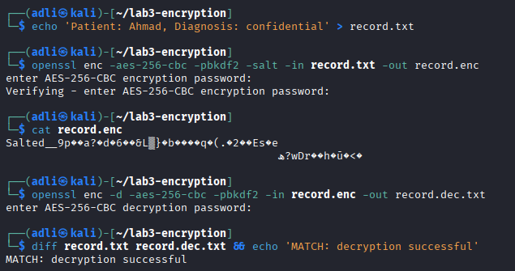

**Result: `MATCH: decryption successful`**

### Task 2 - Asymmetric Encryption & Digital Signatures

A 2048-bit RSA key pair was generated. Data was encrypted with the **public** key and decrypted with the **private** key; a signature was then created with the **private** key and verified with the **public** key - the reverse pairing, which is the basis of PKI and TLS.

```bash
openssl genrsa -out private.pem 2048
openssl rsa -in private.pem -pubout -out public.pem

openssl pkeyutl -encrypt -pubin -inkey public.pem -in record.txt -out record.rsa
openssl pkeyutl -decrypt -inkey private.pem -in record.rsa -out record.rsa.txt

openssl dgst -sha256 -sign private.pem -out record.sig record.txt
openssl dgst -sha256 -verify public.pem -signature record.sig record.txt
```

Encryption/decryption round-tripped correctly, and the signature verification confirmed the record's authenticity and integrity.

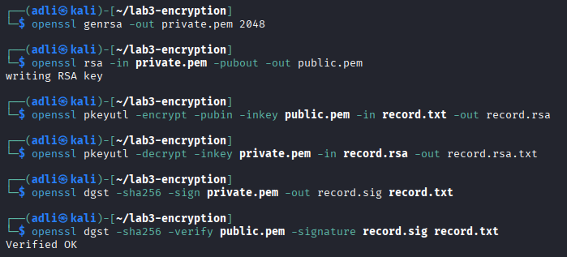

**Result: `Verified OK`**

### Task 3 - Encryption in Transit (TLS)

A self-signed certificate was generated to serve the record over HTTPS. The first attempt used a plain `nginx` container with the cert/key mounted in, but this failed (`curl: (35) Send failure: Broken pipe`) because the stock `nginx` image does not listen for TLS on port 443 without explicit server-block configuration - mounting the cert/key files alone is not enough. The task was completed instead using OpenSSL's own `s_server`, which serves TLS directly from the cert/key pair with no extra configuration.

```bash
openssl req -x509 -newkey rsa:2048 -keyout key.pem -out cert.pem \
-days 7 -nodes -subj '/CN=localhost'

openssl s_server -key key.pem -cert cert.pem -port 8443 -WWW &
curl -k https://localhost:8443/record.txt
```

The file content was retrieved successfully over the encrypted channel, confirming the TLS handshake and data transfer both succeeded.

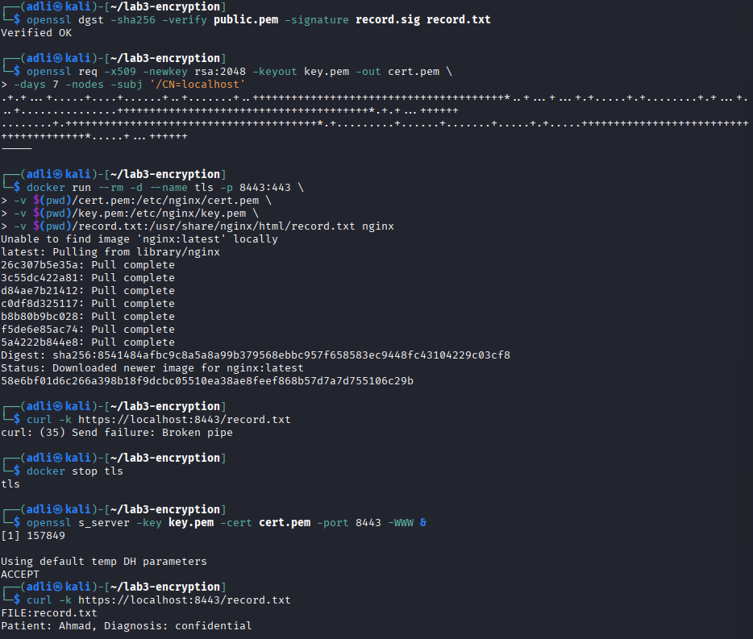

**Result:** Content of `record.txt` received via `curl -k https://localhost:8443/record.txt`, confirming an encrypted, working channel. Compared to plain HTTP, where the same request would travel in clear text and be readable to any on-path attacker, TLS made the intercepted channel unreadable.

*End of Session A. The TLS server was stopped, and `record.enc`, the RSA key pair, and all other outputs were retained for Session B and for this report.*

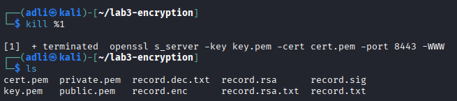

## Session B (Week 6) - Key Management, Envelope Encryption & Erasure

### Task 4 - Create and Use a KMS Master Key

A customer master key (CMK) was created in LocalStack KMS for **tenant A**, and used to encrypt a small value directly - demonstrating the most basic KMS operation before moving to envelope encryption for larger data.

```bash
EP='--endpoint-url=http://localhost:4566'

aws $EP kms create-key --description 'CCSE tenant-A master key'
KEY_A=<KeyId from output>

aws $EP kms encrypt --key-id $KEY_A --plaintext "$(echo -n 'hello' | base64)" \
--query CiphertextBlob --output text
```

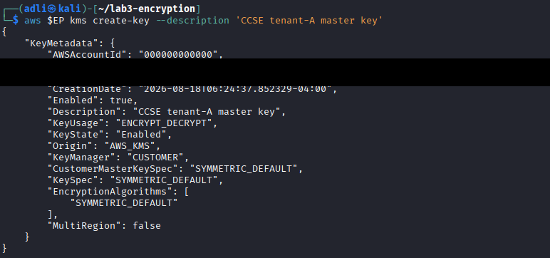

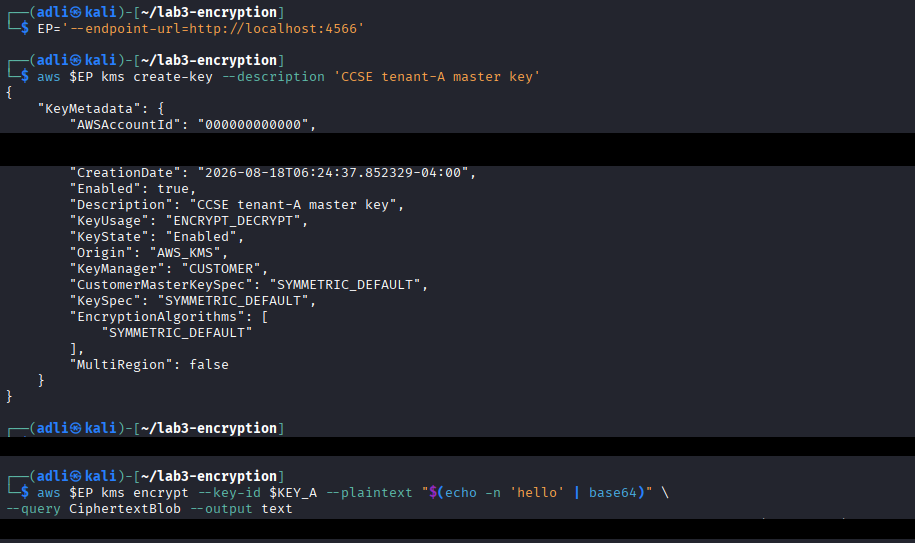

**Result:** Master key created and confirmed usable - `kms encrypt` returned a valid ciphertext blob.

### Task 5 - Envelope Encryption

Rather than encrypting the full record directly with the master key, a one-time **data key** was requested from KMS, which returned both a plaintext copy and a copy wrapped (encrypted) by the master key. The plaintext copy was used locally with OpenSSL to encrypt the record, then deleted immediately - leaving only the wrapped copy on disk.

```bash
aws $EP kms generate-data-key --key-id $KEY_A --key-spec AES_256 \
--query '[Plaintext,CiphertextBlob]' --output text
# column 1 -> datakey.b64 (plaintext)   column 2 -> datakey.enc (wrapped)

base64 -d datakey.b64 > datakey.bin
openssl enc -aes-256-cbc -pbkdf2 -in record.txt -out record.env.enc -pass file:./datakey.bin

rm datakey.bin datakey.b64
echo 'Only the KMS-wrapped data key (datakey.enc) remains.'
```

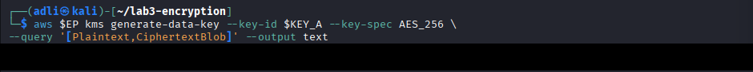

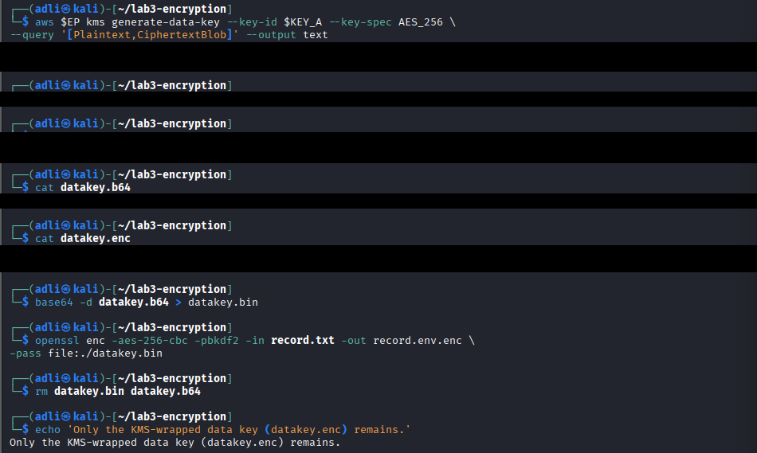

**Result:** After cleanup, `ls` confirmed `datakey.enc` (wrapped) and `record.env.enc` (envelope-encrypted record) remained, while `datakey.bin` and `datakey.b64` (plaintext data key) no longer existed on disk.

### Task 6 - Per-Tenant Keys & Cryptographic Erasure

A second, separate master key was created for **tenant B**, to model per-tenant key isolation on shared infrastructure. Tenant A's key was then scheduled for deletion to simulate cryptographic erasure of tenant A's data.

```bash
aws $EP kms create-key --description 'CCSE tenant-B master key'
KEY_B=<KeyId from output>

aws $EP kms schedule-key-deletion --key-id $KEY_A --pending-window-in-days 7
aws $EP kms disable-key --key-id $KEY_A

aws $EP kms decrypt --ciphertext-blob fileb://datakey.enc 2>&1 | head -3
```

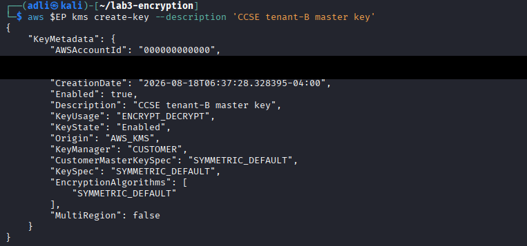

Once `schedule-key-deletion` was applied, the follow-up `disable-key` call was itself rejected (`KMSInvalidStateException`), since the key was already in the more advanced `PendingDeletion` state - a key pending deletion is already effectively unusable, so disabling it is redundant.

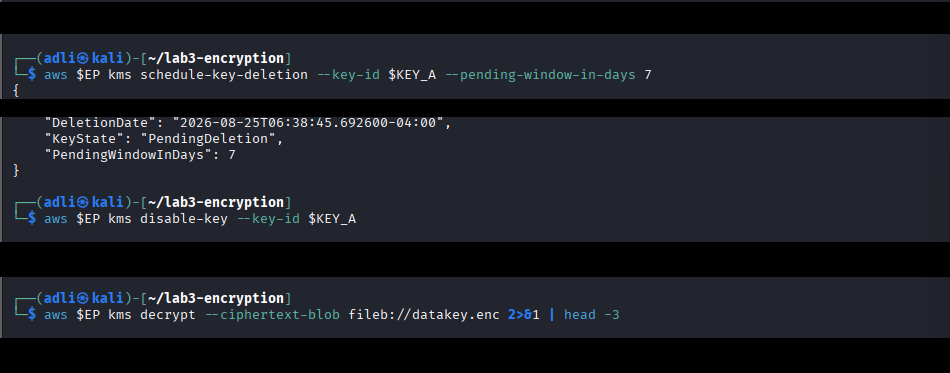

The critical test was then attempting to unwrap `datakey.enc` (tenant A's wrapped data key) after its master key was no longer usable:

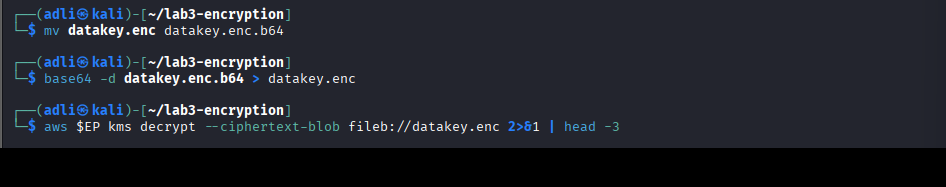

**Result:** The decrypt attempt failed with `KMSInvalidStateException`. Once the master key that wrapped `datakey.enc` was gone, `record.env.enc` became permanently unrecoverable - by design, not even the provider (LocalStack, standing in for AWS) can reverse this. This is **cryptographic erasure**: tenant B's key and data were never touched, proving that per-tenant keys keep deletion scoped to a single tenant.

### Task 7 - Integrity & Tamper-Evidence

Encryption protects confidentiality; hashing protects integrity. The SHA-256 hash of the original record was compared against a tampered copy to show how sensitively a hash reacts to change, then a simple hash chain was built to show how tampering in a log can be detected.

```bash
sha256sum record.txt

cp record.txt tampered.txt; echo 'x' >> tampered.txt
sha256sum record.txt tampered.txt
```

Appending a single character to the copy produced a completely different hash from the original - confirming even a one-byte change is immediately detectable.

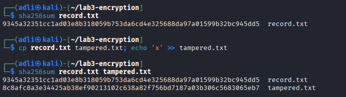

```bash
PREV=0
for line in 'login ok' 'file read' 'export data'; do
  PREV=$(echo -n "$PREV$line" | sha256sum | cut -d' ' -f1)
  echo "$line | $PREV"
done
```

Each entry's hash was computed using the previous entry's hash as part of its input, chaining all three log lines together.

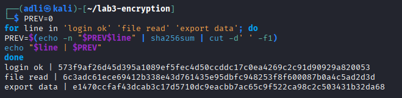

**Result:** Tamper-evidence demonstrated at both the single-file level (hash mismatch) and the log level (hash chain).

## Verification

```bash
aws --endpoint-url=http://localhost:4566 kms list-keys
openssl dgst -sha256 -verify public.pem -signature record.sig record.txt
```

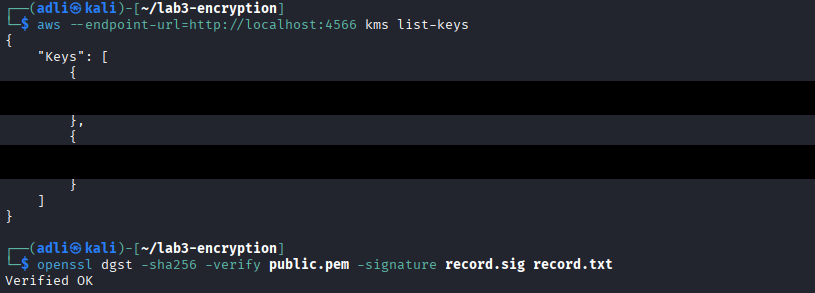

**Result:** Both tenant-A and tenant-B master keys are listed in LocalStack KMS, and the RSA signature check independently re-confirms `Verified OK`.

## Short-Answer Questions

**Q1. What is the key-distribution problem with symmetric encryption, and why does it matter for the cloud?**

Symmetric encryption uses one shared key for both encryption and decryption, so that key must reach every party who needs it. If the key is intercepted in transit, the attacker can read everything encrypted with it. In the cloud, data and services are distributed across many components, so safely getting a shared key to every party that needs it - without ever exposing it in transit or at rest - becomes a hard problem at scale.

**Q2. Why is key management described as the weakest link, not the algorithm?**

Algorithms like AES-256 and RSA-2048 are not practically breakable with current technology. Breaches happen instead because keys are mishandled - left in plaintext, hardcoded, over-shared, or never rotated. An attacker who obtains the key does not need to break the mathematics at all, so how the key is stored and controlled matters more than which algorithm was chosen.

**Q3. Explain envelope encryption and why only the master key needs hardware-grade protection.**

Envelope encryption uses a one-time data key to encrypt the actual data locally, then wraps that data key with a master key stored in the KMS. The master key never touches the bulk data directly - it only wraps and unwraps small data keys on demand. Since the master key is the single point that could expose every data key it has ever wrapped, it is the one component that justifies hardware-grade protection (e.g. an HSM); the data keys are numerous, short-lived, and individually low-value.

**Q4. How does cryptographic erasure achieve provable deletion where overwriting cannot (in the cloud)?**

In the cloud, physical storage is virtualised and replicated, so a customer cannot reliably overwrite every physical copy of their data. Cryptographic erasure avoids this problem: if the data was encrypted with a key, deleting that key makes the ciphertext permanently unrecoverable, regardless of how many copies of the ciphertext still exist - no access to the underlying disk is required.

**Q5. How does a hash chain make a log tamper-evident?**

Each entry's hash is calculated using the previous entry's hash as part of its input, so every entry depends on the full history before it. Changing, deleting, or reordering any entry changes its hash, which breaks every hash after it in the chain - so tampering anywhere in the log is detectable by recomputing the chain.

## Security Best-Practices Checklist

- [x] Data encrypted at rest (AES) and decryption verified.
- [x] Asymmetric keys used correctly (encrypt with public, sign with private).
- [x] Data protected in transit with TLS.
- [x] Envelope encryption used; plaintext data key not left on disk.
- [x] Per-tenant keys used; cryptographic erasure demonstrated.
- [x] Integrity verified with hashing / hash chain.

## Cleanup & Teardown

```bash
rm -f record.* private.pem public.pem key.pem cert.pem datakey.* tampered.txt
docker stop localstack && docker rm localstack
```

## Conclusion

Lab 3 demonstrated data protection from first principles through to cloud-scale key management. Session A established the cryptographic fundamentals: AES for fast symmetric encryption, RSA for asymmetric encryption and signatures, and TLS for protecting data in transit - with a real-world troubleshooting moment (the failed `nginx` TLS attempt) reinforcing that certificates alone do not configure a working TLS server. Session B showed how these fundamentals scale in the cloud through a KMS: envelope encryption kept the master key isolated from bulk data, per-tenant keys kept tenant A's and tenant B's data cryptographically separate, and scheduling tenant A's key for deletion proved cryptographic erasure directly - `datakey.enc` became permanently unusable the moment its wrapping key was gone. Finally, hashing and a hash chain confirmed that integrity is a separate concern from confidentiality, and that tampering - whether in a single file or a sequential log - is detectable. Together, these results show that strong encryption is necessary but not sufficient: how the keys are managed, wrapped, isolated, and destroyed is what ultimately determines whether data is actually protected.
