# IKB42603 - Lab 4: Access Control & Network Security

| Item | Details |
| --- | --- |
| Course | IKB42603 - Cloud Computing Security Essentials |
| Lab | Lab 4 - Access Control & Network Security |
| Student name | Muhammad Adli Firdaus |
| Student ID | 52215225178 |
| Operating System | Kali Linux (VMware Workstation) |
| Date completed | 29 August 2026 |

> **Note on redaction:** The demo password used in Task 1, its derived hash, and any command showing it in plaintext have been redacted with black boxes before inclusion in this report. This is standard practice before publishing lab evidence to a shared or public repository, even for a lab-only credential. Surrounding commands and system responses remain fully visible so the workflow and outcome of each step can still be verified.

## Objective

This lab covers access control and network security, split into two sessions:

- **Session A** covers identity: authentication (proving who you are), a second factor (MFA/TOTP), and authorization (what you are allowed to do once authenticated), using Kubernetes RBAC.
- **Session B** covers the network and host layer: segmenting a three-tier application so a compromised front-end cannot reach the database directly, applying a default-deny firewall policy, and hardening a container to reduce its attack surface.

By the end of this lab, the following outcomes are demonstrated:
1. A password-protected service, tested with and without valid credentials.
2. A TOTP (MFA) code generated and validated.
3. RBAC roles enforced - a limited role allowed one action and denied others.
4. Three-tier network segmentation - the front tier blocked from reaching the data tier directly.
5. A default-deny firewall ruleset with one explicit allow rule.
6. A hardened, non-root, read-only container, and an image vulnerability scan.

## Session A (Week 7) - Authentication & Authorization

### Task 1 - Authentication: a Password-Protected Service

An `htpasswd` credential file was generated for user `student`. The first attempt served this behind `nginx` with `auth_basic`, but unauthenticated requests still returned `200` instead of `401` regardless of which password hash format was used (bcrypt, `apr1` MD5-crypt, and standard `$1$` MD5-crypt were all tried) - `nginx -T` and `docker exec` both confirmed the configuration and credential file were loaded correctly, so the enforcement failure was specific to how this `nginx` build evaluated `auth_basic`, not the configuration itself. Switching to **Apache httpd**, which uses its own native `auth_basic` implementation, resolved this immediately with no other changes.

```bash
docker run --rm httpd:alpine htpasswd -nbB student 'P@ssw0rd!' > htpasswd.txt
```

```bash
cat > httpd-auth.conf <<'EOF'
<Location "/">
    AuthType Basic
    AuthName "Restricted"
    AuthUserFile "/usr/local/apache2/conf/.htpasswd"
    Require valid-user
</Location>
EOF
```

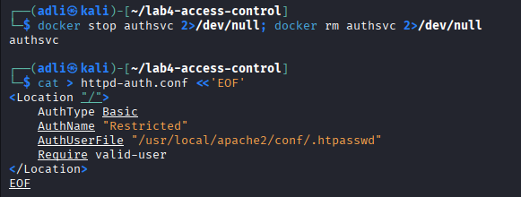

```bash
docker run --rm -d --name authsvc -p 8080:80 \
 -v $(pwd)/httpd-auth.conf:/usr/local/apache2/conf/extra/httpd-auth.conf \
 -v $(pwd)/htpasswd.txt:/usr/local/apache2/conf/.htpasswd \
 httpd:alpine sh -c "echo 'Include conf/extra/httpd-auth.conf' >> /usr/local/apache2/conf/httpd.conf && httpd-foreground"
```

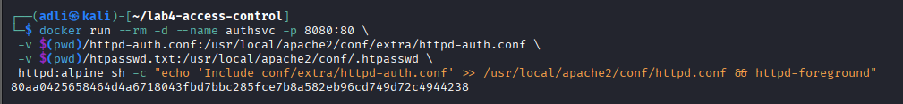

```bash
curl -s -o /dev/null -w 'no-creds: %{http_code}\n' http://localhost:8080
curl -s -u student:'P@ssw0rd!' http://localhost:8080
```

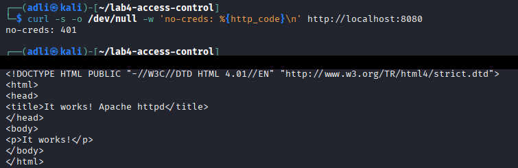

**Result:** `no-creds` -> **401**, valid credentials -> **200**. Authentication is enforced exactly as intended - an unauthenticated request is rejected before reaching the service.

### Task 2 - Add a Second Factor (MFA / TOTP)

A shared secret was generated and used to produce a TOTP code, then validated against a freshly regenerated code - the same check an authenticator app relies on.

```bash
SECRET=$(head -c20 /dev/urandom | base32)
CODE=$(oathtool --totp -b "$SECRET")
[ "$CODE" = "$(oathtool --totp -b "$SECRET")" ] && echo 'MFA OK' || echo 'MFA FAILED'
```

**Troubleshooting note:** an interactive attempt using `read` to type the code back in failed twice - once from a `zsh`-specific `read -p` incompatibility, and once from simply taking too long to copy and retype the code, which let the 30-second TOTP window expire before validation. TOTP codes are time-based, not static, so any delay between generating and validating a code can cause a legitimate code to be rejected. Generating and validating within the same command resolved this.

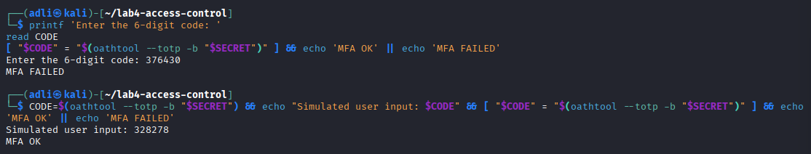

**Result: `MFA OK`**

### Task 3 - Authorization: RBAC Roles

A Kubernetes cluster was created, and a `dev` service account was bound to a role permitting only `get` and `list` on pods - nothing else.

```bash
kind create cluster --name ccse-lab4
kubectl create namespace app
kubectl create serviceaccount dev -n app
kubectl create role dev-role -n app --verb=get,list --resource=pods
kubectl create rolebinding dev-rb -n app --role=dev-role --serviceaccount=app:dev
```

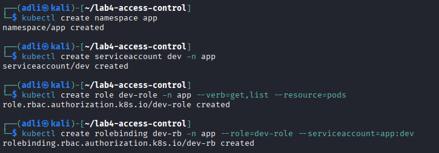

```bash
SA=system:serviceaccount:app:dev
kubectl auth can-i list pods -n app --as=$SA
kubectl auth can-i create deploy -n app --as=$SA
kubectl auth can-i delete pods -n app --as=$SA
```

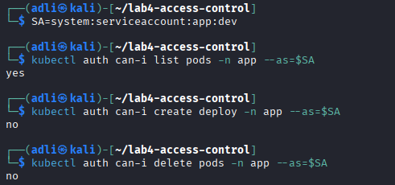

**Result:** `list pods` -> **yes**, `create deploy` -> **no**, `delete pods` -> **no**. The `dev` service account was authenticated as a valid identity in the cluster, but authorization restricted it strictly to the two verbs granted by its role - demonstrating that authentication and authorization are enforced as separate, independent controls.

*End of Session A.* `docker stop authsvc` was run to close out Task 1.

## Session B (Week 8) - Network Security & Hardening

### Task 4 - Network Segmentation (Three-Tier)

Two isolated Docker networks were created to separate a front tier from a data tier, with the application tier bridging both - a common three-tier segmentation pattern.

```bash
docker network create frontend-net
docker network create backend-net
```

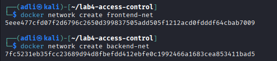

```bash
docker run -d --name db --network backend-net redis:alpine
docker run -d --name app --network backend-net nginx
docker network connect frontend-net app
docker run -d --name web --network frontend-net nginx
```

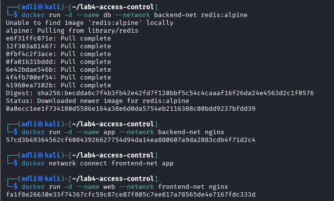

Connectivity was then tested in both directions. Since the base `nginx`/`redis` images do not include `curl` or `netcat` and lack a package manager that matches across images, connectivity was tested using bash's built-in `/dev/tcp` socket redirection instead - avoiding an install step entirely:

```bash
docker exec web bash -c 'timeout 3 bash -c "echo > /dev/tcp/db/6379" && echo REACHABLE || echo BLOCKED'
docker exec app bash -c 'timeout 3 bash -c "echo > /dev/tcp/db/6379" && echo REACHABLE || echo BLOCKED'
```

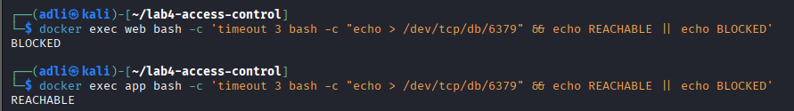

**Result:** `web -> db` -> **BLOCKED**, `app -> db` -> **REACHABLE**. The front-facing `web` tier has no path to the database at all; only the `app` tier, which shares `backend-net` with `db`, can reach it. An attacker who compromises `web` still cannot talk to the data tier directly.

### Task 5 - Firewall Rules (Default-Deny)

A default-deny firewall policy was modelled inside a disposable container (not the host), permitting only loopback traffic and port 443.

```bash
docker run --rm --cap-add=NET_ADMIN alpine sh -c '\
 apk add -q iptables; \
 iptables -P INPUT DROP; \
 iptables -A INPUT -p tcp --dport 443 -j ACCEPT; \
 iptables -A INPUT -i lo -j ACCEPT; \
 iptables -L INPUT -n'
```

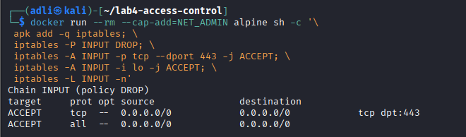

**Result:** Policy `DROP` by default, with exactly two explicit `ACCEPT` rules (port 443, loopback). Nothing else is reachable unless a rule is added for it - the same least-privilege model used by cloud security groups.

### Task 6 - Container / Host Hardening

A container was run as a non-root user, with a read-only root filesystem, all Linux capabilities dropped, and privilege escalation disabled.

```bash
docker run -d --name hardened \
 --user 1000:1000 \
 --read-only \
 --cap-drop=ALL \
 --security-opt no-new-privileges \
 --tmpfs /tmp \
 nginxinc/nginx-unprivileged
```

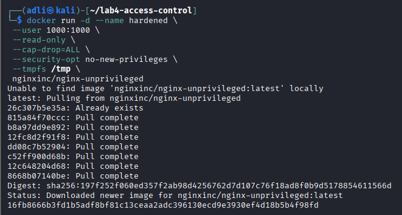

```bash
docker inspect hardened --format 'User={{.Config.User}} ReadOnly={{.HostConfig.ReadonlyRootfs}}'
```

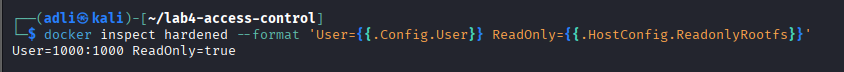

The base image was then scanned for known vulnerabilities:

```bash
docker run --rm aquasec/trivy image --severity HIGH,CRITICAL nginx:alpine | head -20
```

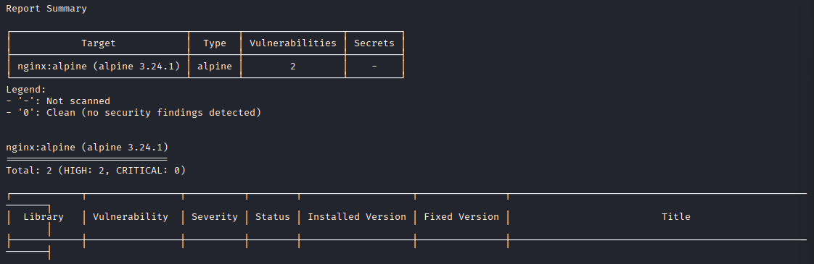

**Result:** `nginx:alpine` (alpine 3.24.1) returned **2 HIGH, 0 CRITICAL** vulnerabilities. Three hardening measures were applied, each closing off a distinct attack path:

| Hardening measure | Attack it blunts |
| --- | --- |
| `--user 1000:1000` (non-root) | Container-breakout privilege escalation to the host, and root-owned file tampering inside the container |
| `--read-only` root filesystem | Malware or a webshell attempting to write new files or modify existing binaries inside a running container |
| `--cap-drop=ALL` | Kernel-level exploits that depend on a Linux capability the container should never need (e.g. `NET_RAW` for raw packet crafting) |

## Verification

```bash
kubectl get rolebinding dev-rb -n app -o yaml
docker inspect hardened --format '{{json .HostConfig.CapDrop}}'
```

![RoleBinding YAML confirms dev-role bound to the dev ServiceAccount; CapDrop confirms ["ALL"]](Evidence-Lab4/verification-rbac-capdrop.png)

**Result:** The `dev-rb` RoleBinding correctly links `dev-role` to the `dev` ServiceAccount in namespace `app`, and the hardened container confirms all Linux capabilities are dropped.

## Short-Answer Questions

**Q1. Explain the difference between authentication and authorization using Tasks 1 and 3.**

Authentication confirms *who you are* - in Task 1, a request had to present a valid username and password before the service would treat it as legitimate. Authorization confirms *what you are allowed to do once identified* - in Task 3, the `dev` service account was a fully authenticated identity in the cluster, yet its RBAC role restricted it to only `get`/`list` on pods; `create` and `delete` were denied even though the identity itself was valid. The two checks are independent: being authenticated does not imply being authorized for a given action.

**Q2. Why is MFA so effective, and which attacks does it defeat?**

MFA requires two factors from different classes - typically something you know (a password) and something you have (a TOTP-generating device or secret). An attacker who obtains the password alone still cannot authenticate without the second factor. This defeats the majority of credential-based attacks: phishing, credential stuffing, password reuse from other breaches, and brute-force guessing - all of which only ever obtain the first factor.

**Q3. How does network segmentation limit the damage of a compromised web server?**

In Task 4, the `web` container had no network path to `db` at all, since they were placed on separate Docker networks. Only `app`, which was deliberately connected to both networks, could reach the database. If an attacker compromises `web`, segmentation confines them to the front tier - they cannot move laterally to the database without first compromising the `app` tier as well, which limits the blast radius of the initial breach.

**Q4. What does a default-deny firewall policy achieve, and how does it relate to cloud security groups?**

A default-deny policy (`iptables -P INPUT DROP`) rejects all traffic unless a rule explicitly permits it, rather than trying to enumerate and block every possible unwanted connection. In Task 5, only port 443 and loopback traffic were allowed; everything else was refused by default. This is the exact model used by cloud security groups (AWS Security Groups, Azure NSGs) - nothing is reachable unless explicitly opened, which minimises the attack surface by design rather than by exception.

**Q5. List the hardening measures you applied and the attack surface each one removes.**

1. `--user 1000:1000` (run as non-root) - removes the path from a container compromise to root-level access on the host or root-owned files inside the container.
2. `--read-only` root filesystem - removes the ability for malware or an attacker to write new files, drop a webshell, or modify existing binaries inside a running container.
3. `--cap-drop=ALL` - removes every Linux capability the container does not explicitly need, closing off kernel-level exploits that rely on a specific capability (e.g. raw sockets, module loading) being available.

## Security Best-Practices Checklist

- [x] Service requires authentication (unauthenticated requests rejected).
- [x] MFA / second factor implemented and validated.
- [x] Authorization enforced by RBAC (least privilege; unauthorised actions denied).
- [x] Network segmented so the data tier is unreachable from the front tier.
- [x] Default-deny firewall with explicit allow rules.
- [x] Container hardened: non-root, minimal, capabilities dropped, read-only; image scanned.

## Cleanup & Teardown

```bash
docker rm -f authsvc db app web hardened 2>/dev/null
docker network rm frontend-net backend-net 2>/dev/null
kind delete cluster --name ccse-lab4
```

## Conclusion

Lab 4 worked through access control and network security as two layers of the same principle: identity must be verified, and then strictly limited to what it needs. Session A showed authentication, MFA, and authorization as three distinct, stackable controls - Task 3 in particular made clear that a valid identity is not the same as unrestricted access. Session B moved the same principle to the network and host layer: segmentation contained a compromised front tier away from the database, a default-deny firewall closed every port that wasn't explicitly needed, and container hardening removed root access, write access, and unnecessary kernel capabilities from a running service. Task 1 also surfaced a practical lesson beyond the lab's core content: a correctly written configuration is not the same as a correctly enforced control, and confirming a security control actually works - not just that it looks right on paper - is exactly the kind of verification this lab is meant to build the habit of doing.
