# IKB42603 - Lab 5: Monitoring, Logging & Incident Detection

| Item | Details |
| --- | --- |
| Course | IKB42603 - Cloud Computing Security Essentials |
| Lab | Lab 5 - Monitoring, Logging & Incident Detection |
| Student name | Muhammad Adli Firdaus |
| Student ID | 52215225178 |
| Operating System | Kali Linux (VMware Workstation) |
| Date completed | 29 August 2026 |

> **Note on redaction:** No credentials, keys, or personally identifiable data appear in this lab's evidence. The IP addresses used throughout (`203.0.113.9`, `10.0.0.5`) are drawn from ranges reserved for documentation and private use (RFC 5737 / RFC 1918), not real hosts, so no redaction was necessary for this report.

## Objective

This lab covers monitoring, logging, and incident detection, split into two sessions:

- **Session A** builds visibility: generating application logs, centralising them into a cloud log service (CloudWatch Logs, via LocalStack), and querying them for security-relevant activity.
- **Session B** turns that visibility into detection and response: making logs tamper-evident with a hash chain, detecting an incident by correlating multiple log events, and running the core incident-response steps.

By the end of this lab, the following outcomes are demonstrated:
1. Logs generated locally and centralised into a cloud log store.
2. Logs distinguished from events, and queried for failed-login activity.
3. A tamper-evident, hash-chained log, with proof that altering an entry breaks the chain.
4. An incident detected purely by correlating multiple log lines together.
5. The incident-response lifecycle: detect, contain, collect evidence, document.

## Session A (Week 9) - Logging & Centralisation

### Setup - Start LocalStack

LocalStack was started to provide a local, disposable CloudWatch Logs endpoint, and a log group/stream were created to receive application logs.

```bash
docker run -d --name localstack -p 4566:4566 -e DISABLE_EVENTS=1 localstack/localstack:3.0
```

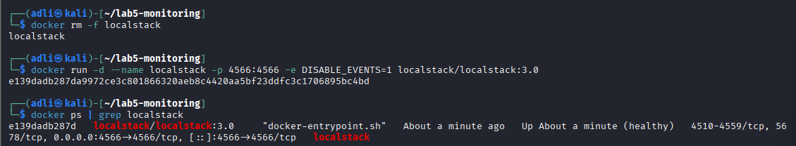

```bash
EP='--endpoint-url=http://localhost:4566'
curl http://localhost:4566/_localstack/health

aws $EP logs create-log-group --log-group-name /ccse/app
aws $EP logs create-log-stream --log-group-name /ccse/app --log-stream-name auth
```

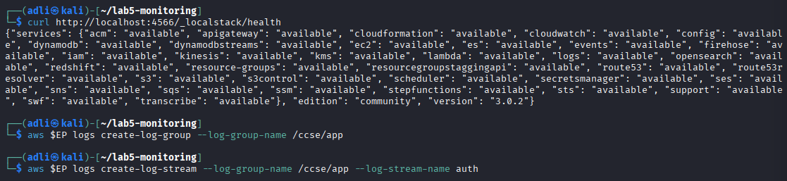

### Task 1 - Generate Application Logs

A small authentication log was created by hand, modelling an attacker probing a login endpoint: four failed logins from the same IP, followed by a successful login, followed by a large data export - all from that same IP.

```bash
cat > auth.log <<'EOF'
2025-03-01T09:00:01 LOGIN_OK user=ahmad ip=10.0.0.5
2025-03-01T09:01:10 LOGIN_FAIL user=admin ip=203.0.113.9
2025-03-01T09:01:12 LOGIN_FAIL user=admin ip=203.0.113.9
2025-03-01T09:01:15 LOGIN_FAIL user=admin ip=203.0.113.9
2025-03-01T09:01:18 LOGIN_FAIL user=admin ip=203.0.113.9
2025-03-01T09:01:22 LOGIN_OK user=admin ip=203.0.113.9
2025-03-01T09:01:40 EXPORT_DATA user=admin ip=203.0.113.9 size=500MB
EOF

cat auth.log
```

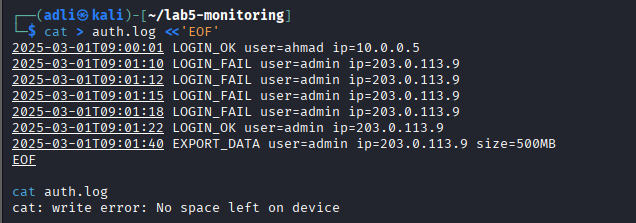

**Result:** Seven log lines generated, matching the brute-force-then-exfiltration pattern this lab is built around.

### Task 2 - Centralise Logs (Ship to CloudWatch)

Each line of `auth.log` was shipped individually to the central log stream, then read back directly from the log service - not from the local file - to confirm the logs are now centrally stored.

```bash
TS=$(date +%s000)
while IFS= read -r line; do
  aws $EP logs put-log-events --log-group-name /ccse/app --log-stream-name auth \
  --log-events timestamp=$TS,message="$line" >/dev/null
  TS=$((TS+1000))
done < auth.log
```

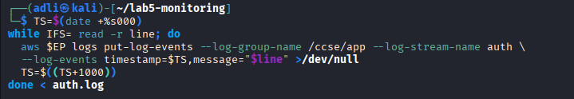

```bash
aws $EP logs get-log-events --log-group-name /ccse/app --log-stream-name auth \
--query 'events[].message' --output text
```

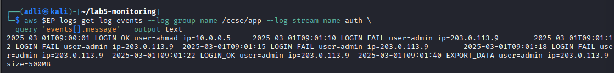

**Result:** All seven log lines were retrieved from the centralised store, confirming logs are no longer only sitting on a single host - the cascading-collection model referenced in this lab.

### Task 3 - Query for Security-Relevant Activity

```bash
grep LOGIN_FAIL auth.log | awk '{print $4, $5}' | sort | uniq -c
```

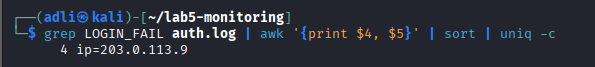

**Result: `4 user=admin ip=203.0.113.9`.** A log is a durable record that must be actively queried to find something like this; an event, by contrast, would have fired this same finding automatically and in near real time (e.g. an alert the moment the fourth failure occurred), without waiting for someone to run a query.

*End of Session A. `auth.log` and the centralised read-back were kept for Session B.*

## Session B (Week 10) - Tamper-Proofing, Detection & Response

### Task 4 - Tamper-Proof (Hash-Chained) Logs

Each line of `auth.log` was chained to the previous line's hash, so that every entry's hash depends on the full history before it - the same construction used in Lab 3.

```bash
PREV=0
while IFS= read -r line; do
  PREV=$(printf '%s%s' "$PREV" "$line" | sha256sum | cut -d' ' -f1)
  printf '%s | %s\n' "$line" "$PREV"
done < auth.log > auth.chain

cat auth.chain
```

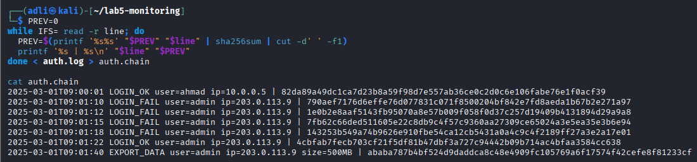

To prove tampering is detectable, the `EXPORT_DATA` line was altered to under-report the exfiltrated size (`500MB` -> `5MB`) - modelling an attacker editing the log to hide what they took:

```bash
sed 's/500MB/5MB/' auth.log > auth.tampered
```


The chain was then recomputed from the tampered file and compared to the original chain's final hash:

```bash
PREV=0
while IFS= read -r line; do
  PREV=$(printf '%s%s' "$PREV" "$line" | sha256sum | cut -d' ' -f1)
done < auth.tampered

echo "Final hash (tampered): $PREV"
echo "Final hash (original): $(tail -1 auth.chain | cut -d'|' -f2 | xargs)"
```

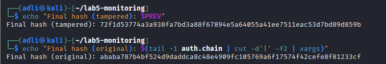

**Result:**
- Tampered final hash: `72f1d53774a3a938fa7bd3a88f67894e5a64055a41ee7511eac53d7bd89d859b`
- Original final hash: `ababa787b4bf524d9daddca8c48e4909fc105769a6f17574f42cefe8f81233cf`

The two hashes are completely different, even though only one number in one line was changed. This proves the chain detects tampering anywhere in the log, not just at the point of the edit.

### Task 5 - Detect the Incident (Correlation)

No single line in `auth.log` is inherently malicious on its own - a failed login happens, a successful login happens, a data export happens. Correlating all three by IP is what reveals the incident:

```bash
IP=203.0.113.9
FAILS=$(grep -c "LOGIN_FAIL.*$IP" auth.log)
SUCCESS=$(grep -c "LOGIN_OK.*$IP" auth.log)
EXPORT=$(grep -c "EXPORT_DATA.*$IP" auth.log)
echo "IP=$IP fails=$FAILS success=$SUCCESS export=$EXPORT"

if [ "$FAILS" -ge 3 ] && [ "$SUCCESS" -ge 1 ] && [ "$EXPORT" -ge 1 ]; then
  echo 'ALERT: probable brute-force -> compromise -> data exfiltration'
fi
```

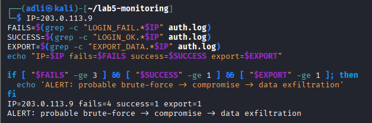

**Result:** `fails=4 success=1 export=1` -> **`ALERT: probable brute-force -> compromise -> data exfiltration`**. This is the same principle a SIEM applies at scale: individually unremarkable events become a clear detection once correlated by a shared attribute (here, source IP) across a time window.

### Task 6 - Incident Response

With the incident detected, the response lifecycle was carried out: contain the source, then collect tamper-evident evidence.

**Contain** - the attacker's IP was blocked, modelled with an `iptables` rule inside a disposable container (not the host):

```bash
docker run --rm --cap-add=NET_ADMIN alpine sh -c \
 'apk add -q iptables; iptables -A INPUT -s 203.0.113.9 -j DROP; iptables -L INPUT -n | tail -2'
```

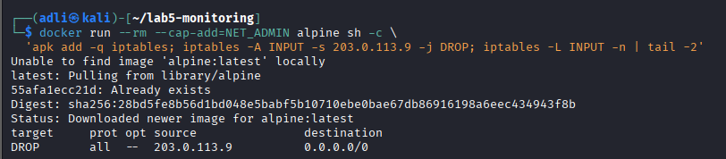

**Collect** - an immutable, timestamped copy of the log was made, and its hash recorded as evidence of integrity at the time of collection:

```bash
cp auth.log evidence_$(date +%Y%m%d).log
sha256sum evidence_*.log > evidence.sha256
cat evidence.sha256
```

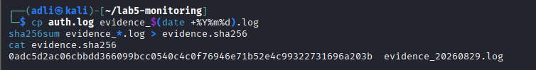

**Result:** Attacker IP `203.0.113.9` blocked at the firewall, and `evidence_20260829.log` preserved with hash `0adc5d2ac06cbbdd366099bcc0540c4c0f76946e71b52e4c99322731696a203b` recorded in `evidence.sha256` - so any future check of this evidence file can confirm it has not been altered since collection.

## Incident Report

**Detection.** A query for failed logins (Task 3) surfaced four `LOGIN_FAIL` attempts against user `admin` from IP `203.0.113.9`. On its own this was only a count; correlating it (Task 5) against a subsequent successful login and a 500MB data export from the same IP within the same minute produced a clear `ALERT: probable brute-force -> compromise -> data exfiltration`.

**Analysis.** The sequence - four failures, one success, one large export, all from one external IP, all within roughly 40 seconds - is consistent with a brute-force attack that succeeded, followed immediately by data exfiltration. The tight time window and the size of the export (500MB) are inconsistent with normal `admin` usage patterns.

**Containment.** The source IP (`203.0.113.9`) was blocked at the firewall with an `iptables DROP` rule, preventing any further inbound connections from that address while the incident is investigated further.

**Evidence & integrity.** A timestamped copy of `auth.log` was preserved as `evidence_20260829.log`, and its SHA-256 hash was recorded separately in `evidence.sha256`. The log had already been hash-chained (Task 4), which independently proved that the `EXPORT_DATA` line had not been altered from its original `500MB` value before this evidence copy was made - ruling out the possibility that the attacker (or anyone else) had already tampered with the export size on disk.

**Lesson learned.** A single failed login, a single successful login, and a single large export are each unremarkable in isolation - none would have triggered a response individually. Only correlating them by a shared attribute (source IP) within a short time window revealed the incident. This argues for centralising logs and running correlation queries routinely, rather than relying on any one log line to "look suspicious" on its own.

## Short-Answer Questions

**Q1. What is the difference between a log and an event? Give an example of each from this lab.**

A log is a durable, stored record of something that happened, which must be actively queried or reviewed to find anything in it - `auth.log` itself, and the `grep`/`awk` query in Task 3 that counted failed logins, are both examples of working with logs. An event is a real-time trigger fired the moment something notable happens, without waiting for anyone to query it - the `ALERT: probable brute-force -> compromise -> data exfiltration` output in Task 5 is an event: it was generated the instant the correlation condition was met, not discovered later by manually reading the log.

**Q2. Why must audit logs be tamper-proof, and how does a hash chain achieve this?**

If an attacker who compromises a system can also edit its logs, the logs can no longer be trusted as evidence of what actually happened - exactly what Task 4 modelled, where the `EXPORT_DATA` line was edited to hide the true size of the data taken. A hash chain makes this detectable: each entry's hash is computed from the entry itself plus the previous entry's hash, so every entry depends on the full history before it. Changing any single entry - even by one character - changes that entry's hash, which then changes every hash after it in the chain, so the final hash no longer matches the original. Task 4 demonstrated this directly: changing `500MB` to `5MB` changed the final chain hash completely.

**Q3. How did correlation detect an incident that no single log line revealed?**

Individually, `LOGIN_FAIL`, `LOGIN_OK`, and `EXPORT_DATA` are all routine log entries that occur during normal operation - none of them is inherently an attack on its own. Task 5 correlated all three by a shared attribute (the same source IP, `203.0.113.9`) and confirmed a minimum count for each (at least 3 fails, at least 1 success, at least 1 export). Only once all three conditions were true together did the pattern become a confirmed incident - the same brute-force-then-exfiltration story that no single line, read in isolation, would have told.

**Q4. List the incident-response steps you performed and the goal of each.**

1. **Detect** (Task 5) - correlate log events to confirm an incident is actually occurring, rather than reacting to noise.
2. **Contain** (Task 6) - block the attacker's IP with an `iptables DROP` rule, to stop further damage while the incident is investigated.
3. **Collect evidence** (Task 6) - preserve a timestamped copy of the log and record its hash, so what was observed at the time of the incident can be proven later, even in court or an audit.
4. **Document** (this Incident Report) - record what happened, how it was found, what was done, and what was learned, so the response is reviewable and repeatable next time.

**Q5. How do the same logs serve both security monitoring and compliance evidence?**

For security monitoring, logs are the raw material for detection - Tasks 3 and 5 both worked directly from `auth.log` to identify suspicious activity and correlate it into an incident. The same logs also serve as compliance evidence: many regulatory frameworks require organisations to demonstrate that security-relevant activity was recorded, retained, and provably unaltered. The hash-chaining and evidence-hashing done in Tasks 4 and 6 turn the log from a simple operational record into something that can be presented later - to an auditor, a regulator, or a court - with cryptographic proof that it has not been tampered with since it was written.

## Security Best-Practices Checklist

- [x] Logs are centralised, not left scattered on each host.
- [x] Security-relevant activity (failed logins) can be queried.
- [x] Logs are tamper-evident (hash chain) and forwarded to a separate store.
- [x] An incident is detected by correlating multiple events.
- [x] Incident response performed: contain, collect evidence, document.

## Verification

```bash
aws --endpoint-url=http://localhost:4566 logs describe-log-groups
sha256sum -c evidence.sha256
```

**Result:** `/ccse/app` confirmed present in LocalStack's log groups, and `sha256sum -c` confirms the collected evidence file still matches its recorded hash.

## Cleanup & Teardown

```bash
rm -f auth.log auth.chain auth.tampered evidence_*.log evidence.sha256
docker stop localstack && docker rm localstack
```

## Conclusion

Lab 5 built the visibility-to-response pipeline that underlies most cloud security operations. Session A established that visibility itself takes deliberate effort: logs had to be generated, shipped to a central store, and queried - none of that happens automatically just because an application is running. Session B showed why that visibility matters: a hash chain proved that logs can be made tamper-evident cheaply, correlation turned three unremarkable log lines into one clear incident, and the response lifecycle (contain, collect, document) showed that detecting an incident is only the first half of the job. The most important result from this lab is arguably the negative one - that no single log line, viewed alone, ever revealed the attack. Only centralised, correlated, and tamper-evident logging made the incident visible at all, which is exactly the case this lab set out to make.
